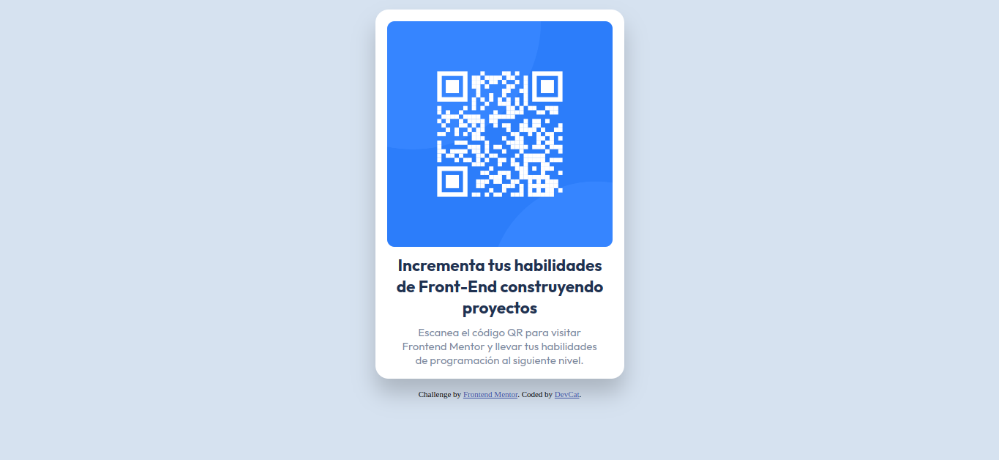

# Frontend Mentor - QR code component solution

This is a solution to the [QR code component challenge on Frontend Mentor](https://www.frontendmentor.io/challenges/qr-code-component-iux_sIO_H). Frontend Mentor challenges help you improve your coding skills by building realistic projects.

## Table of contents

- [Overview](#overview)
  - [Screenshot](#screenshot)
  - [Links](#links)
- [My process](#my-process)
  - [Built with](#built-with)
  - [Continued development](#continued-development)
  - [Useful resources](#useful-resources)
- [Author](#author)

## Overview

I have made a component containing a QR image. I have some issues with the size of the component but it can be improved.

### Screenshot

### Links

- [My solution](https://www.frontendmentor.io/solutions/used-css-and-some-flex-method-yIZkGJt8rJ)
- [Live Site](https://qr-component-mauve.vercel.app)

## My process

### Built with

- Semantic HTML5 markup
- CSS custom properties
- Flexbox

### Continued development

I have to keep in mind the container's sizes.

### Useful resources

- [em and rem](https://refine.dev/blog/rem-vs-em/#introduction) - This page helped me to better understand the use of em and rem.

## Author

- [Lefipe](https://github.com/Lefipe14?tab=repositories)
- [@Lefipe14](https://www.frontendmentor.io/profile/Lefipe14)
